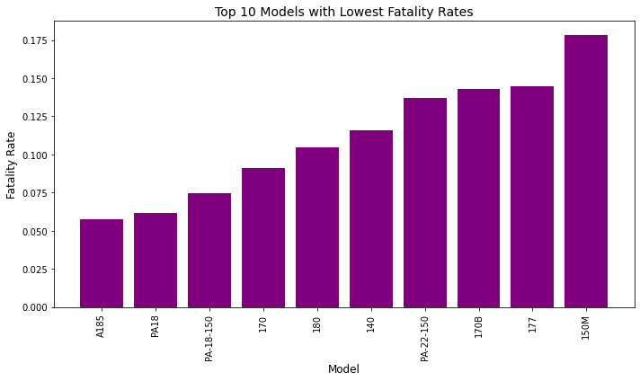

## Final Project Submission

Please fill out:
* Student name: Joackim Kisienya
* Student pace: part time 
* Scheduled project review date/time: 29/04/2025
* Instructor name: Maryann Mwikali
* Blog post URL:


# Business understanding-goals
## Introduction
The company I am working with is interested in purchasing and operating airplanes for commercial and private enterprises.I seek  to determine which aircraft are the lowest risk for the company to start this new business endevor. This will assist the head of the new aviation division make a decision on which aircraft to purchase.

# Data understanding
The data [Aviation_Data.csv](https://www.kaggle.com/datasets/khsamaha/aviation-accident-database-synopses) is sourced from kaggle and it is from the National Transport safety Board.It contains information from 1962 to 2023 about civil aviation accidents and selected incidents within the United States, its territories and possessions, and international waters.

### Setup
* Import pandas and Matplotlib librarries for analysis and plotting respectively.
```python
import pandas as pd #import pandas library to manipulate our dataset
import matplotlib.pyplot as plt #import matplotlib library for visualizations
```
## Data inspection
Load **Aviation_Data.csv** file as **Aviation** DataFrame
```python
Aviation = pd.read_csv('data\Aviation_Data.csv', low_memory = False) #Reading Aviation_Data.csv into a DataFrame 
Aviation.head() #Display the first five records
```
```python
#Display information about our dataset.
Aviation.info()
```
```python
#print number of rows and columns
num_rows, num_cols = Aviation.shape
print(f"\nNumber of rows: {num_rows}")
print(f"Number of columns: {num_cols}")
```
```python
#checking for missing values in our dataset
Aviation.isnull().sum()
```
```python
#checking for percentage of missing values in our dataset
((Aviation.isnull()|Aviation.isna()).sum() *100 / Aviation.index.size).round(2)
```
### Data preparation
* Drop some columns with over 40% missing values.

```python
# Drop selected columns with more than 40% missing values
Drop_cols = ['Latitude', 'Longitude','Airport.Code','Airport.Name','FAR.Description', 'Schedule', 'Air.carrier']
Aviation = Aviation.drop(columns=Drop_cols)
Aviation.isnull().sum()
Aviation.shape
```
```python
# Drop rows with missing values in key columns.
Aviation.dropna(subset=['Make', 'Model', 'Location', 'Total.Fatal.Injuries', 'Aircraft.Category','Weather.Condition',
                            'Purpose.of.flight','Aircraft.damage'], inplace=True)
```
```python
# Strip whitespaces
Aviation = Aviation.apply(lambda x: x.str.strip() if x.dtype == "object" else x)
```
```python
# Convert Total.Fatal.Injuries to numeric
Aviation["Total.Fatal.Injuries"] = pd.to_numeric(Aviation["Total.Fatal.Injuries"], errors="coerce")
```
```python
# Filter out rows with invalid or negative injury values
Aviation = Aviation[Aviation["Total.Fatal.Injuries"] >= 0]
Aviation.shape
```
```python
### Categorize data
* Filter data to required private and commercial airplanes
* Filter data by Airplane category
```
```python
# Define the custom order for sorting
custom_order = ["Personal", "Business", "Ferry", "Executive/Corporate"]
```
```python
# Sort the dataframe based on the custom order
Aviation_sorted = Aviation[Aviation['Purpose.of.flight'].isin(custom_order)].copy()
Aviation_sorted['Purpose.of.flight'] = pd.Categorical(Aviation_sorted['Purpose.of.flight'], categories=custom_order, ordered=True)
Aviation_sorted = Aviation_sorted.sort_values('Purpose.of.flight')
Aviation_sorted.shape
```
```python
#Filter data by Airplane category
Airplanes = Aviation_sorted[Aviation_sorted['Aircraft.Category'] == 'Airplane']
Airplanes.to_csv('airplanes_data.csv', index=False)
```
### Analyze Risk by Airplane Make and Model
* Fatality rate by Make
* Fatality rate by Model
* Popular low risk airplanes

```python
X = 50
# Filter makes with at least X accidents
makes_with_min_accidents = Airplanes.groupby('Make').filter(lambda x: len(x) >= X)
# Calculate fatality rate for each make
fatality_rates_by_make = makes_with_min_accidents.groupby('Make').agg(
    total_accidents=('Event.Id', 'count'),
    total_fatalities=('Total.Fatal.Injuries', 'sum')
)
fatality_rates_by_make['fatality_rate'] = fatality_rates_by_make['total_fatalities'] / fatality_rates_by_make['total_accidents']
# Sort by fatality rate in ascending order
lowest_fatality_rates_by_make = fatality_rates_by_make.sort_values('fatality_rate', ascending=True)
```
```python
X = 50
# Filter models with at least X accidents
models_with_min_accidents = Airplanes.groupby('Model').filter(lambda x: len(x) >= X)
# Calculate fatality rate for each model
fatality_rates = models_with_min_accidents.groupby('Model').agg(
    total_accidents=('Event.Id', 'count'),
    total_fatalities=('Total.Fatal.Injuries', 'sum')
)
fatality_rates['fatality_rate'] = fatality_rates['total_fatalities'] / fatality_rates['total_accidents']
# Sort by fatality rate in ascending order
lowest_fatality_rates = fatality_rates.sort_values('fatality_rate', ascending=True)
```
```python
# Group by Make and Model
risk_analysis = Airplanes.groupby(["Make", "Model"]).agg(
    Total_Accidents=("Event.Id", "count"),
    Total_Fatalities=("Total.Fatal.Injuries", "sum"),
    Avg_Fatalities_Per_Accident=("Total.Fatal.Injuries", "mean")
).reset_index()
```
```python
# Sort by Total_Fatalities to identify low-risk aircraft
low_risk_aircraft = risk_analysis.sort_values(by="Total_Fatalities", ascending=True)
```
```python
# Group by Make and Model for popular aircraft
popular_grouped = Airplanes.groupby(["Make", "Model"]).agg(
    Total_Accidents=("Event.Id", "count"),
    Total_Fatalities=("Total.Fatal.Injuries", "sum"),
    Avg_Fatalities_Per_Accident=("Total.Fatal.Injuries", "mean")
).reset_index()
```
```python
# Define a threshold for popularity (e.g., aircraft with more than 50 accidents)
popular_airplanes = popular_grouped[popular_grouped["Total_Accidents"] > 50]
```
```python
# Sort by Total_Accidents in descending order
popular_airplanes = popular_grouped.sort_values(by="Total_Accidents", ascending=False)
popular_airplanes.head(10)
```
```python
# Weather Analysis
weather_risk = Aviation.groupby('Weather.Condition').agg(Total_Accidents=('Event.Date', 'count'),Fatal_Accidents=('Total.Fatal.Injuries', lambda x: (x > 0).sum())).reset_index()
weather_risk['Fatality_Rate'] = weather_risk['Fatal_Accidents'] / weather_risk['Total_Accidents']
weather_risk
```

### Visualizations
* Fatalities by Make
* Fatalities by Model
* Low risk airplanes

```python
top_10_lowest_fatality_rates = lowest_fatality_rates_by_make.head(10)
# Plot the data
plt.figure(figsize=(10, 6))
plt.bar(top_10_lowest_fatality_rates.index, top_10_lowest_fatality_rates['fatality_rate'], color='indigo')
plt.xlabel('Make', fontsize=12)
plt.ylabel('Fatality Rate', fontsize=12)
plt.title('Top 10 Makes with Lowest Fatality Rates', fontsize=14)
plt.xticks(rotation=90)
plt.tight_layout()
plt.show()
```


```python
# Select the top 10 low-risk popular aircraft 
top_10_low_risk_popular_aircraft = popular_airplanes.head(10)
# Plot the data
plt.figure(figsize=(10, 6))
plt.bar(top_10_low_risk_popular_aircraft['Make'] + " " + top_10_low_risk_popular_aircraft['Model'], 
    top_10_low_risk_popular_aircraft['Total_Fatalities'], color='cadetblue')
plt.xlabel('Aircraft (Make and Model)', fontsize=12)
plt.ylabel('Total Fatalities', fontsize=12)
plt.title('Top 10 Low-Risk Aircraft by Total Fatalities', fontsize=14)
plt.xticks(rotation=90)
plt.tight_layout()
plt.show()
```


```python
plt.figure(figsize=(10, 6))
plt.bar(lowest_fatality_rates.index[:10], lowest_fatality_rates['fatality_rate'][:10], color='blue')
plt.xlabel('Model', fontsize=12)
plt.ylabel('Fatality Rate', fontsize=12)
plt.title('Top 10 Models with Lowest Fatality Rates', fontsize=14)
plt.xticks(rotation=90)
plt.tight_layout()
plt.show()
```





## RECOMMENDATION
From my analysis of Aviation_Data.csv, here are my findings:
1. Purchase CESSNA 172 model which has the lowest risk. Cessna has the lowest fatality rate.
2. CESSNA make has low accident rates and should be considered as the best manufacturer among the ones analysed.
3. VMC weather condition has the highest number of fatalities. Those operating the airplane should take note of this.

```python
Aviation.to_csv('Aviation_Cleaned.csv') # this created a a csv file that can be further explored on Tableau.
```